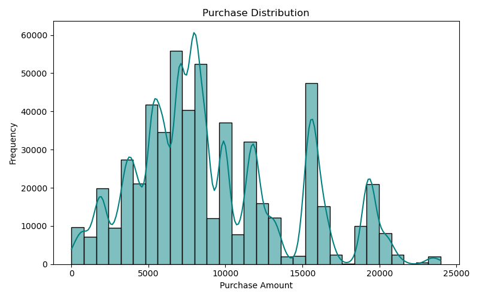
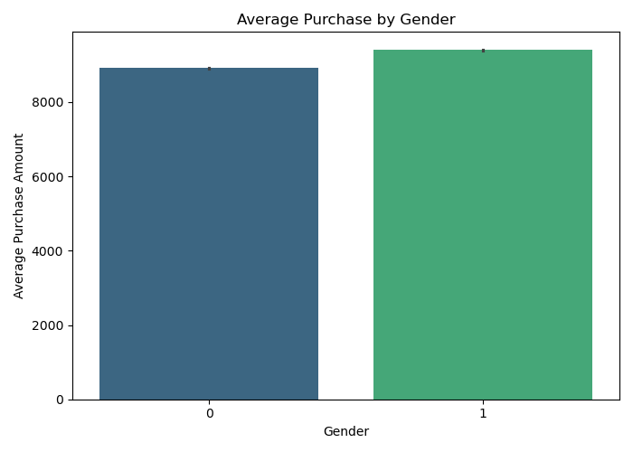
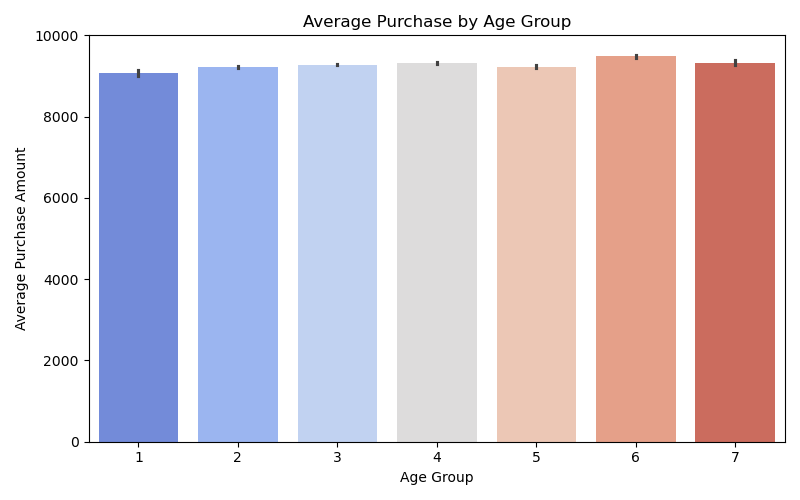

# 🛍️ Black Friday Dataset EDA & Feature Engineering

## 📌 Overview
This project explores the **Black Friday Sales dataset** and applies **EDA + Feature Engineering** to prepare it for machine learning tasks.  
The dataset contains information about customers, demographics, product categories, and purchase behavior.


---

## ⚙️ Tools & Technologies
- Python (Pandas, NumPy, Scikit-learn, Matplotlib, Seaborn)
- Jupyter Notebook
- Feature Engineering

---

## 📊 Key Insights
- Distribution of purchase amounts.
- Impact of **Gender** and **Age groups** on spending.
- Product categories with the highest sales.
- Effect of occupation, city category, and stay duration on purchases.
- Feature engineering applied to categorical variables for ML modeling.

---

## 📸 Visualizations
- **Purchase Distribution**  
    

- **Gender vs Purchase Behavior**  
    

- **Age Group vs Purchase Behavior**  
    

---

## 🚀 How to Run
1. Clone the repository  
   ```bash
   git clone https://github.com/YourUsername/Black-Friday-EDA.git
   cd Black-Friday-EDA
